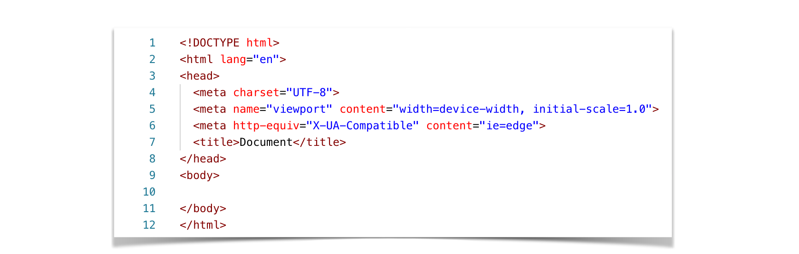

<h1>HTML</h1>
HTML stands for hyper text markup language. 
HTML is used to define the structure of the webpage.

<h2>Understanding the Boiler plate in HTML:</h2>
HTML Boilerplate a set of pre-written of HTML,CSS and JS which forms the starting point of your web project

<h3>Doctype decleration:</h3>
<b>Syntax: <!DOCTYPE html> </b> 
The doc-type decleration is crucial because it tells what version of HTML are we using. 

<h3>HTML Tag:</h3>
<b>Syntax: <html lang "en"></b> 
The <html> tag is the root element of an HTML document.  
Including the lang attribute specifies the language of the content, which is important for accessibility and SEO(Search Engine Optimization).

<h3>Head Section:</h3>
The <head> section contains meta-information about the document, such as the character set, viewport settings, and links to CSS files.

<h3>Body Section:</h3>
The Body section is where you write all the HTML tags.