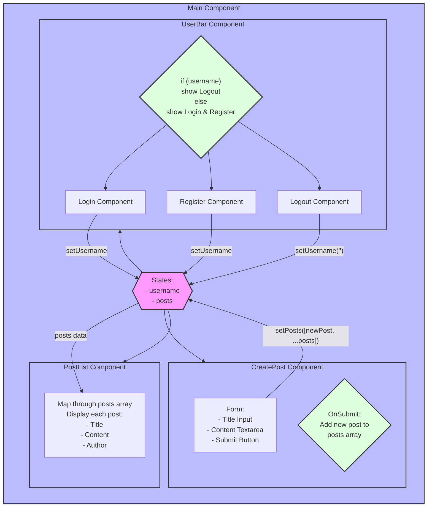

```mermaid
flowchart TB
    subgraph Main[Main Component]
        direction TB
        MainState{{"States:
        - username
        - posts"}}
        MainState --> UserBar
        MainState --> CreatePost
        MainState --> PostList
    end

    subgraph UserBar[UserBar Component]
        direction TB
        Login[Login Component]
        Register[Register Component]
        Logout[Logout Component]
        UserBarLogic{"if (username)
        show Logout
        else 
        show Login & Register"}
        UserBarLogic --> Login
        UserBarLogic --> Register
        UserBarLogic --> Logout
    end

    subgraph CreatePost[CreatePost Component]
        direction TB
        CreatePostForm["Form:
        - Title Input
        - Content Textarea
        - Submit Button"]
        CreatePostLogic{"OnSubmit:
        Add new post to
        posts array"}
    end

    subgraph PostList[PostList Component]
        direction TB
        Posts["Map through posts array
        Display each post:
        - Title
        - Content
        - Author"]
    end

    %% Data Flow Connections
    Login --"setUsername"--> MainState
    Register --"setUsername"--> MainState
    Logout --"setUsername('')"--> MainState
    CreatePostForm --"setPosts([newPost, ...posts])"--> MainState
    MainState --"posts data"--> Posts

    classDef stateClass fill:#f9f,stroke:#333,stroke-width:2px
    classDef componentClass fill:#bbf,stroke:#333,stroke-width:2px
    classDef logicClass fill:#dfd,stroke:#333,stroke-width:2px
    
    class MainState stateClass
    class Main,UserBar,CreatePost,PostList componentClass
    class UserBarLogic,CreatePostLogic logicClass
```